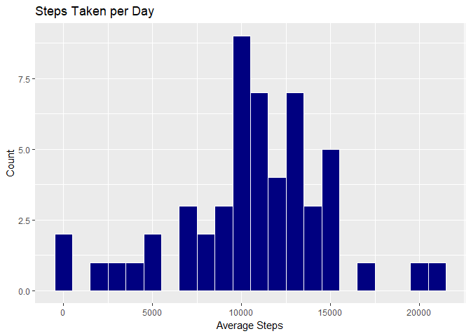
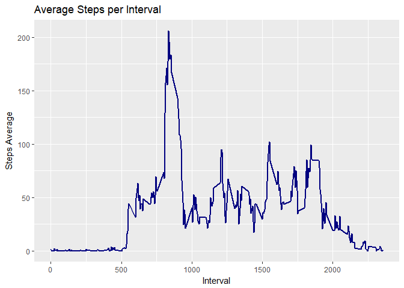
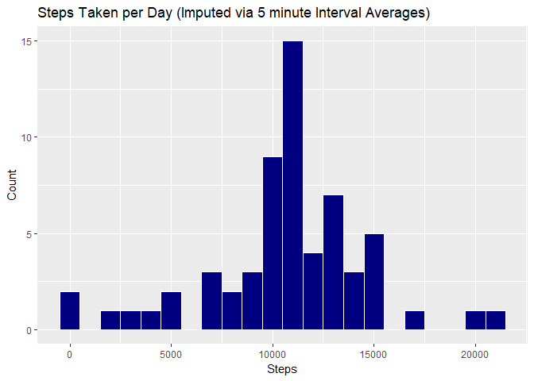
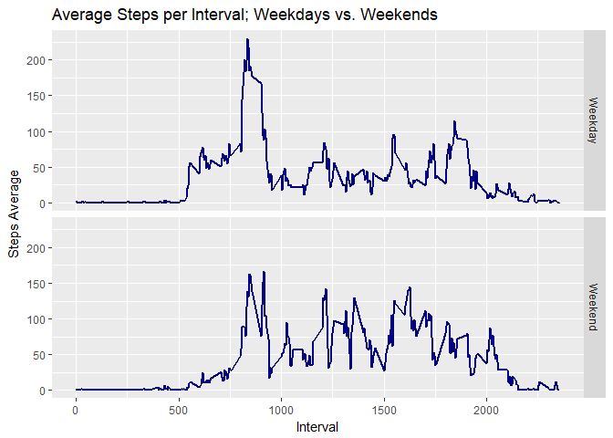

Introduction
------------

It is now possible to collect a large amount of data about personal
movement using activity monitoring devices such as a Fitbit, Nike
Fuelband, or Jawbone Up. These type of devices are part of the
"quantified self" movement - a group of enthusiasts who take
measurements about themselves regularly to improve their health, to find
patterns in their behavior, or because they are tech geeks. But these
data remain under-utilized both because the raw data are hard to obtain
and there is a lack of statistical methods and software for processing
and interpreting the data.

The purpose of this report is to perform an analysis on a sample data
set from a personal activity monitoring device. This device collects
data at 5 minute intervals through out the day. The data consists of two
months of data from an anonymous individual collected during the months
of October and November, 2012 and include the number of steps taken in 5
minute intervals each day.

The variables included in this dataset are:

-   steps: Number of steps taking in a 5-minute interval (missing values
    are coded as NA)
-   date: The date on which the measurement was taken in YYYY-MM-DD
    format
-   interval: Identifier for the 5-minute interval in which measurement
    was taken

The dataset is stored in a comma-separated-value (CSV) file and there
are a total of 17,568 observations in this dataset.

Setup
-----

Set the working directory:

    directory <- "C:/Users/Public"
    setwd(directory)

Load the necessary packages:

    library(ggplot2)
    library(dplyr)
    library(chron)

Download file, unzip, and read file into R, and process the data.

    zip_file <- download.file("https://d396qusza40orc.cloudfront.net/repdata%2Fdata%2Factivity.zip", 
                  destfile = "C:/Users/Public/data.zip")
    unzip("data.zip")
    activity <- read.csv("activity.csv")
    activity$Day <- weekdays(as.Date(activity$date))
    activity_no_NA <- activity[!is.na(activity$steps),]

Part 1: What is the mean total number of steps taken per day?
-------------------------------------------------------------

Calculate the total number of steps taken for each day in the dataset.

    sum_steps <- activity_no_NA %>%
      group_by(date) %>%
      summarize(steps = sum(steps, na.rm = TRUE))

A histogram of the total number of steps taken each day can now be
created:

    p <- ggplot(sum_steps, aes(x=steps)) + 
      geom_histogram(binwidth = 1000, color="white", fill="navy") +
      labs(title="Steps Taken per Day",x="Average Steps", y = "Count")
    p

    mean_num_steps <- as.integer(mean(sum_steps$steps))

The mean of the total number of steps taken per day is: 10766

    median_num_steps <- as.integer(median(sum_steps$steps))

The median of the total number of steps taken per day is: 10765

Part 2: What is the average daily activity pattern?
---------------------------------------------------

Calculate the mean number of steps, grouped by each 5-minute interval.

    Int <- activity_no_NA %>%
      group_by(interval) %>%
      summarize(Avg = mean(steps))

A time series plot of the 5-minute interval (x-axis) and the average
number of steps taken, averaged across all days (y-axis) can now be
created:

    q <- ggplot(Int, aes(x=interval, y=Avg)) +
      geom_line(size = 1, color = "navy") +
      labs(title = "Average Steps per Interval", x = "Interval", y = "Steps Average")
    q

Which 5-minute interval, on average across all the days in the dataset,
contains the maximum number of steps?

    summarize(Int, as.integer(max(Avg)))

    ## # A tibble: 1 x 1
    ##   `as.integer(max(Avg))`
    ##                    <int>
    ## 1                    206

    Int[Int$Avg==max(Int$Avg),1]

    ## # A tibble: 1 x 1
    ##   interval
    ##      <int>
    ## 1      835

Part 3: Imputing Missing Values
-------------------------------

Calculate and report the total number of missing values in the dataset
(i.e. the total number of rows with NAs).

    sum_na_activity <- sum(is.na(activity$steps))

The total number of missing values in the dataset is: 2304

The strategy used for filling in missing step values in the dataset is
using the mean for that 5-minute interval.

    avg_steps_per_int <- activity_no_NA %>%
      group_by(interval) %>%
      summarize(steps = as.integer(mean(steps)))

Combine missing steps data with the average steps per 5-min interval
data.

    na_activity <- activity[is.na(activity$steps),]
    imp_activity <- merge(na_activity, avg_steps_per_int, by = c("interval"))
    imp_activity <- rename(imp_activity, steps = steps.y)
    imp_activity$steps.x <- NULL
    imp_activity_RE <- imp_activity[,c(4,2,1,3)]

Create a new dataset that is equal to the original dataset but with the
missing data filled in.

    merge_imp <- bind_rows(activity_no_NA, imp_activity_RE)

Calcuate the average number of steps taken per day.

    sum_steps_imp <- merge_imp %>%
      group_by(date) %>%
      summarize(steps = sum(steps))

A histogram of the total number of steps taken each day for the imputed
dataset can now be created:

    r <- ggplot(sum_steps_imp, aes(x=steps)) + 
      geom_histogram(binwidth = 1000, color="white", fill="navy") +
      labs(title="Steps Taken per Day (Imputed via 5 minute Interval Averages)",x="Steps", y = "Count")
    r

    mean_num_steps_imp <- as.integer(mean(sum_steps_imp$steps))

The mean of the total number of steps taken per day for the imputed data
set is: 10749

    median_num_steps_imp <- as.integer(median(sum_steps_imp$steps))

The median of the total number of steps taken per day for the imputed
data set is: 10641

The values of the imputed data set (mean, median = 10749, 10641) are
different from the original data set (mean, median = 10766, 10765). The
mean and median of the imputed dataset is lower than that original
dataset, which is reasonable since the imputed data strategy involved
using the averages of the 5-minute intervals for the missing data.

Part 4: Are there differences in activity patterns between weekdays and weekends?
---------------------------------------------------------------------------------

Identify if a day is a weekend (TRUE) or a weekday (FALSE):

    merge_imp$is_Weekend <- is.weekend(merge_imp$date)
    merge_imp$Weekend <- ifelse (merge_imp$is_Weekend == TRUE, "Weekend", "Weekday")

Calculate the average number of steps for each interval, grouped by
weekends and weekdays.

    Int_wk <- merge_imp %>%
      group_by(interval,Weekend) %>%
      summarize(Avg = mean(steps))

A panel plot containing a time series plot of the 5-minute interval
(x-axis) and the average number of steps taken, averaged across all
weekday days or weekend days (y-axis) can now be created:

    s <- ggplot(Int_wk, aes(x=interval, y=Avg)) +
      facet_grid(Weekend ~.) +
      geom_line(size = 1, color = "navy") +
      labs(title = "Average Steps per Interval; Weekdays vs. Weekends", x = "Interval", y = "Steps Average")
    s

